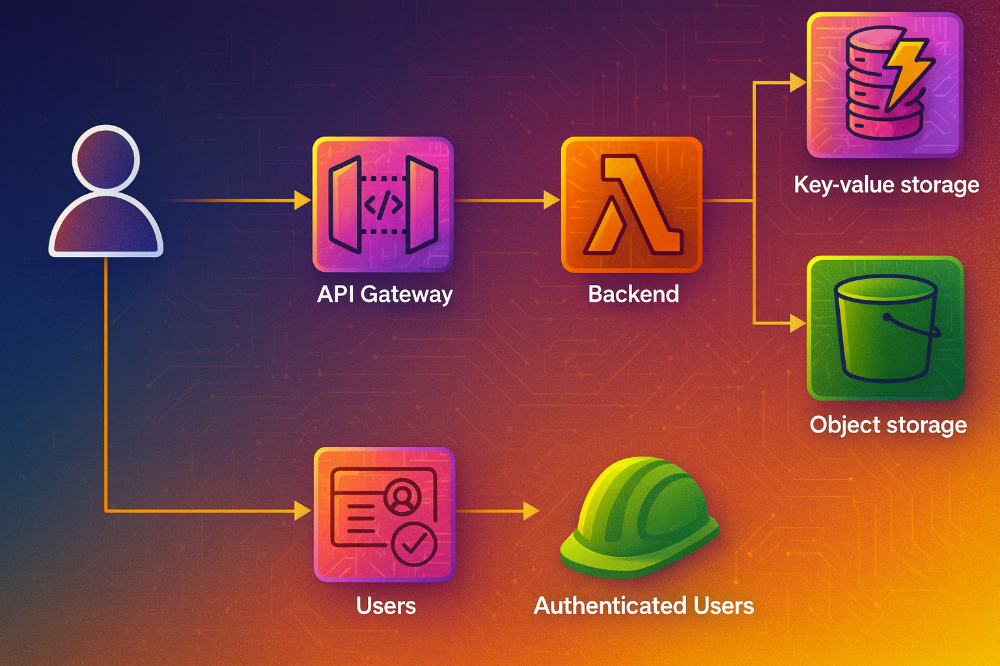

# AWS CRUD API - CDK Construct

A powerful AWS CDK construct that enables you to create fully-featured CRUD APIs with minimal configuration. Built on top of AWS API Gateway, Lambda, and DynamoDB, this package provides out-of-the-box CRUD operations with extensive customization options.

## Features

- 🚀 **Quick Setup**: Create a complete CRUD API with just a few lines of code
- 🔧 **Highly Configurable**: Customize every aspect of your API operations
- 🔒 **Built-in Security**: Owner-based access control and team permissions
- 📦 **S3 Integration**: Store large data objects in S3 automatically
- 📡 **Event System**: Optional IoT event dispatching for real-time updates
- 🧪 **Well Tested**: Comprehensive test suite with high coverage
- 📚 **TypeScript First**: Full TypeScript support with detailed type definitions

## Architecture

<p align="center">
  
  <br />
  <i>Figure I - Base CRUD Architecture</i>
</p>

The construct creates a REST API using Amazon API Gateway with Lambda functions for CRUD operations. Data is stored in DynamoDB with optional S3 integration for large objects. The architecture supports:

- **API Gateway**: RESTful endpoint management
- **Lambda Functions**: Serverless CRUD operation handlers  
- **DynamoDB**: Primary data storage with configurable indexes
- **S3**: Optional large object storage
- **IoT Core**: Optional real-time event notifications

## Installation

```bash
npm install @nerdiyland/aws-crud-api-rest
```

## Quick Start

### 1. Create a new CDK project

```bash
# Create a new CDK app
cdk init app --language=typescript

# Install the package
npm install @nerdiyland/aws-crud-api-rest
```

### 2. Basic Usage

```typescript
import { Stack, StackProps } from 'aws-cdk-lib';
import { RestApi } from 'aws-cdk-lib/aws-apigateway';
import { Construct } from 'constructs';
import { BaseCrudApi } from '@nerdiyland/aws-crud-api-rest';

export class MyApiStack extends Stack {
  constructor(scope: Construct, id: string, props?: StackProps) {
    super(scope, id, props);

    // Create the main API
    const api = new RestApi(this, 'MyApi', {
      restApiName: 'My CRUD API',
      description: 'A sample CRUD API using aws-crud-api-rest'
    });

    // Create a CRUD resource for "tasks"
    const tasksCrud = new BaseCrudApi(this, 'TasksCRUD', {
      EnvironmentName: 'dev',
      Api: api,
      ResourcePath: 'tasks',
      GlobalParent: api.root,
      Operations: {
        Create: {
          OperationName: 'createTask'
        },
        ListOwned: {
          IndexName: 'ByUserId',
          OperationName: 'listTasks'
        },
        Read: {
          OperationName: 'getTask'
        },
        Update: {
          OperationName: 'updateTask'
        },
        Delete: {
          OperationName: 'deleteTask'
        }
      }
    });
  }
}
```

### 3. Deploy

```bash
cdk deploy
```

This creates a complete CRUD API with endpoints:
- `POST /tasks` - Create a new task
- `GET /tasks` - List user's tasks
- `GET /tasks/{id}` - Get a specific task
- `PUT /tasks/{id}` - Update a task
- `DELETE /tasks/{id}` - Delete a task

## Configuration Options

### Basic Configuration

```typescript
const crud = new BaseCrudApi(this, 'ItemsCRUD', {
  // Required
  EnvironmentName: 'production',
  Api: api,
  ResourcePath: 'items',
  GlobalParent: api.root,
  Operations: { /* operations */ },

  // Optional - Custom field names
  IdFieldName: 'itemId',           // Default: 'Id'
  OwnerFieldName: 'ownerId',       // Default: 'UserId'
  IdResourceName: 'itemId',        // Default: 'id' (for URL path)
  
  // Optional - Use existing resources
  Table: existingTable,            // Use existing DynamoDB table
  BackendFunction: existingFunc,   // Use existing Lambda function
  Bucket: existingBucket,          // Use existing S3 bucket
});
```

### Operations Configuration

Define which CRUD operations to enable and customize their behavior:

```typescript
Operations: {
  Create: {
    OperationName: 'createItem',
    SuccessEvent: 'ItemCreated'    // Optional IoT event
  },
  
  List: {
    OperationName: 'listAllItems'  // Public list (all items)
  },
  
  ListOwned: {
    IndexName: 'ByUserId',
    OperationName: 'listMyItems'   // User-specific list
  },
  
  Read: {
    OperationName: 'getItem',
    Security: {                    // Custom security rules
      Owner: { Fields: ['title', 'description'] },
      Public: { Fields: ['title'] }
    }
  },
  
  Update: {
    OperationName: 'updateItem',
    SuccessEvent: 'ItemUpdated'
  },
  
  Delete: {
    OperationName: 'deleteItem',
    SuccessEvent: 'ItemDeleted'
  }
}
```

### S3 Integration

Store large objects in S3 automatically:

```typescript
const crud = new BaseCrudApi(this, 'DocumentsCRUD', {
  // ... basic config
  Bucket: myBucket,
  S3Fields: {
    content: {
      Prefix: 'documents/',
      DataFormat: 'json',
      ContentType: 'application/json'
    },
    attachment: {
      Prefix: 'attachments/',
      DataFormat: 'raw',
      ContentType: 'application/octet-stream'
    }
  }
});
```

### Parent-Child Resources

Create nested resources with parent-child relationships:

```typescript
// Parent resource: Projects
const projectsCrud = new BaseCrudApi(this, 'ProjectsCRUD', {
  // ... configuration
});

// Child resource: Tasks within projects
const tasksCrud = new BaseCrudApi(this, 'TasksCRUD', {
  EnvironmentName: 'dev',
  Api: api,
  ResourcePath: 'tasks',
  GlobalParent: projectsCrud.globalResource,
  ParentResourceName: 'projectId',
  ParentFieldName: 'ProjectId',
  Operations: {
    Create: { OperationName: 'createTask' },
    ListOwned: { 
      IndexName: 'ByProjectId',
      OperationName: 'listProjectTasks' 
    }
  }
});
```

## API Reference

### BaseCrudApiProps

| Property | Type | Description | Required |
|----------|------|-------------|----------|
| `EnvironmentName` | string | Environment identifier | ✅ |
| `Api` | RestApi | API Gateway instance | ✅ |
| `ResourcePath` | string | URL path for the resource | ✅ |
| `GlobalParent` | IResource | Parent resource for global operations | ✅ |
| `Operations` | BaseCrudApiOperations | CRUD operations to enable | ✅ |
| `IndividualParent` | IResource | Parent for individual operations | ❌ |
| `IdFieldName` | string | Database ID field name (default: 'Id') | ❌ |
| `ParentFieldName` | string | Parent ID field name | ❌ |
| `OwnerFieldName` | string | Owner field name (default: 'UserId') | ❌ |
| `IdResourceName` | string | URL parameter name (default: 'id') | ❌ |
| `ParentResourceName` | string | Parent resource identifier | ❌ |
| `Table` | ITable | Existing DynamoDB table | ❌ |
| `Bucket` | IBucket | S3 bucket for large objects | ❌ |
| `BackendFunction` | IFunction | Existing Lambda function | ❌ |
| `S3Fields` | object | S3 field configuration | ❌ |
| `Validator` | RequestValidator | API Gateway validator | ❌ |

### BaseCrudApiOperations

Configure which operations to enable:

```typescript
interface BaseCrudApiOperations {
  Create?: BaseCrudApiOperationConfiguration;
  Read?: BaseCrudApiOperationConfiguration;
  List?: BaseCrudApiOperationConfiguration;      // Public list
  ListOwned?: BaseCrudApiOperationConfiguration; // User-owned list
  Update?: BaseCrudApiOperationConfiguration;
  Delete?: BaseCrudApiOperationConfiguration;
}
```

### BaseCrudApiOperationConfiguration

```typescript
interface BaseCrudApiOperationConfiguration {
  OperationName: string;              // Lambda function identifier
  IndexName?: string;                 // DynamoDB index for queries
  SuccessEvent?: string;              // IoT event topic suffix
  Security?: SecurityConfiguration;   // Access control rules
  BackendFunction?: IFunction;        // Override default function
}
```

## Examples

### Blog API Example

```typescript
// Create a blog post API
const blogCrud = new BaseCrudApi(this, 'BlogCRUD', {
  EnvironmentName: 'production',
  Api: api,
  ResourcePath: 'posts',
  GlobalParent: api.root,
  Operations: {
    Create: {
      OperationName: 'createPost',
      SuccessEvent: 'PostPublished'
    },
    List: {
      OperationName: 'listPosts'  // Public posts
    },
    ListOwned: {
      IndexName: 'ByUserId',
      OperationName: 'listMyPosts'  // Author's posts
    },
    Read: {
      OperationName: 'getPost',
      Security: {
        Public: { Fields: ['title', 'content', 'publishedAt'] },
        Owner: { Fields: ['title', 'content', 'publishedAt', 'draft'] }
      }
    },
    Update: {
      OperationName: 'updatePost'
    },
    Delete: {
      OperationName: 'deletePost'
    }
  }
});
```

### E-commerce Product Catalog

```typescript
const productsCrud = new BaseCrudApi(this, 'ProductsCRUD', {
  EnvironmentName: 'production',
  Api: api,
  ResourcePath: 'products',
  GlobalParent: api.root,
  Bucket: productImagesBucket,
  S3Fields: {
    images: {
      Prefix: 'products/images/',
      DataFormat: 'json'
    },
    specifications: {
      Prefix: 'products/specs/',
      DataFormat: 'json'
    }
  },
  Operations: {
    Create: {
      OperationName: 'createProduct',
      SuccessEvent: 'ProductCreated'
    },
    List: {
      OperationName: 'listProducts'
    },
    Read: {
      OperationName: 'getProduct'
    },
    Update: {
      OperationName: 'updateProduct'
    }
  }
});
```

## Security

The construct implements owner-based access control by default:

- **Create**: Users can create items that are automatically owned by them
- **List**: `List` operations return all items, `ListOwned` returns only user's items
- **Read/Update/Delete**: Users can only access items they own

### Custom Security Rules

Configure field-level access control:

```typescript
Security: {
  Owner: {
    Fields: ['id', 'title', 'content', 'private_notes']
  },
  Public: {
    Fields: ['id', 'title', 'content']
  }
}
```

## Event System

Enable real-time notifications through AWS IoT Core:

```typescript
{
  Create: {
    OperationName: 'createItem',
    SuccessEvent: 'ItemCreated'  // Publishes to: EnvironmentName/events/{userId}/ItemCreated
  }
}
```

Event payload includes:
```json
{
  "Id": "item-id",
  "UserId": "user-id", 
  "EventId": "unique-event-id",
  "EventDate": "2024-01-01T00:00:00.000Z"
}
```

## Advanced Configuration

### Custom Lambda Function

```typescript
const customFunction = new Function(this, 'CustomCRUD', {
  runtime: Runtime.NODEJS_18_X,
  handler: 'custom.handler',
  code: Code.fromAsset('lambda')
});

const crud = new BaseCrudApi(this, 'CustomCRUD', {
  // ... other config
  BackendFunction: customFunction
});
```

### Custom DynamoDB Table

```typescript
const customTable = new Table(this, 'CustomTable', {
  partitionKey: { name: 'PK', type: AttributeType.STRING },
  sortKey: { name: 'SK', type: AttributeType.STRING }
});

const crud = new BaseCrudApi(this, 'CustomCRUD', {
  // ... other config
  Table: customTable,
  IdFieldName: 'PK',
  ParentFieldName: 'SK'
});
```

## Troubleshooting

### Common Issues

**Issue**: `Table already exists` error during deployment
**Solution**: Use `cdk destroy` to remove existing resources or provide an existing table via the `Table` prop.

**Issue**: Permission denied errors
**Solution**: Ensure your Lambda execution role has the necessary DynamoDB and S3 permissions. The construct adds these automatically unless you provide a custom `BackendFunction`.

**Issue**: CORS errors in browser
**Solution**: Configure CORS on your API Gateway:

```typescript
const api = new RestApi(this, 'MyApi', {
  defaultCorsPreflightOptions: {
    allowOrigins: Cors.ALL_ORIGINS,
    allowMethods: Cors.ALL_METHODS
  }
});
```

### Debug Mode

Enable detailed logging by setting environment variables:

```typescript
BackendFunction: new Function(this, 'Backend', {
  // ... config
  environment: {
    LOG_LEVEL: 'DEBUG'
  }
})
```

## Contributing

We welcome contributions! Please see our [Contributing Guide](CONTRIBUTING.md) for details.

## License

This project is licensed under the MIT License - see the [LICENSE](LICENSE) file for details.

## Changelog

See [CHANGELOG.md](CHANGELOG.md) for a history of changes to this project.
